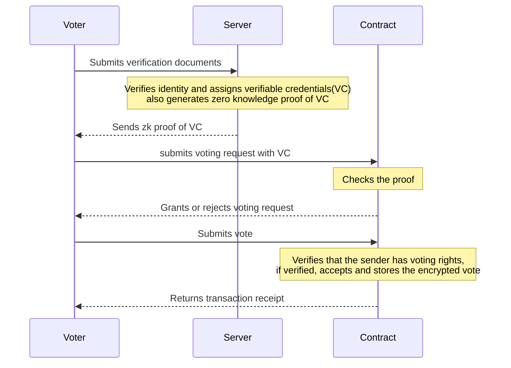

# Elektor

## Project Overview

This project is a secure and decentralized voting platform that checks for voters' eligibility and uses zero-knowledge proofs to ensure their anonymity throughout the voting process.
We implemented a workflow that begins with potential voters submitting an identity verification document (National Identification Number (NIN)), which would be cross-referenced with government databases to verify the voter's identity, age, and nationality. The age is used to check for the voter's eligibility. Once eligibility is confirmed, the system acts as an issuer, providing the voter with a zero-knowledge proof of a verifiable credential (VC).
The voting process then progresses to an on-chain verification phase, during which voters present their zero-knowledge proof to an on-chain verifier, who checks the proof's validity without revealing personal information. Upon successful verification, voters are granted permission to cast their votes anonymously.
The project aims to revolutionize the voting process, making it more secure, transparent, and accessible while preserving voter privacy.

## Project Structure

The project repository contains the following directories:

```sh
.
├── README.md
├── Elektor-contracts (Solidity smart contracts)
├── Elektor-backend (Node.js server)
└── Elektor-frontend (Vite React frontend)
```

## Architecture



## Deployment Addresses
### 1. Factory Contract 
- Polygon - [address](url)

### URL
The website is live @ [here](https://elektor.netlify.app) ✨

### Technologies Used
- [PrivadoID](https://docs.privado.id/)
- [Honojs](https://hono.dev/)


### Contributors

- Isaac Adewumi ([@prettyirrelevant](https://github.com/prettyirrelevant)): Backend Engineer
- Olayinka Ganiyu ([@jaybee020](https://github.com/Jaybee020)): Smart Contract Engineer
- Tobi Faniran ([@fantee-hub](https://github.com/fantee-hub)): Frontend Engineer
- Mogboluwaga Onayade ([@MogboPython](https://github.com/MogboPython)): Project Manager

## Challenges Faced

During the development of this project, we encountered several obstacles related to using Privado ID. The documentation was really poor and having to figure out things by endlessly scouring for examples hindered our progress. We overcame these by finding and piecing together multiple sources and examples. The privado team also provided assistance to us when we reached out to them on their [telegram](https://t.me/PrivadoID_Official) support channel.

## Contributing

We believe in the power of collaboration and welcome contributions from all members of the community irrespective of your domain knowledge and level of expertise,
your input is valuable.
Here are a few ways you can get involved:

- **Spread the Word**: Help us reach more enthusiasts by sharing the project with your network. The more creators and collectors we bring together, the stronger our community becomes.
- **Feature Requests**: If you have ideas for new features or improvements, share them with us! We're excited to hear how we can enhance the marketplace to better serve the community.
- **Code Contributions**: Developers can contribute by submitting pull requests. Whether it's fixing bugs, optimizing code, or adding new functionalities, your code contributions are invaluable.
- **Bug Reports and Feedback**: If you encounter any issues or have suggestions for improvement, please open an issue on GitHub.

****
