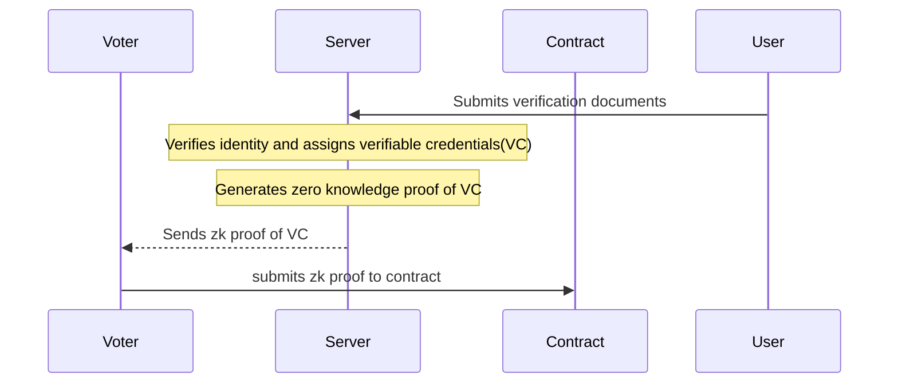

# Elektor

## Project Overview

This project is a secure and decentralized voting platform that checks for voters' eligibility and uses zero-knowledge proofs to ensure their anonymity throughout the voting process.
We implemented a workflow that begins with potential voters submitting an identity verification document (National Identification Number (NIN)), which would be cross-referenced with government databases to verify the voter's identity, age, and nationality. The age is used to check for the voter's eligibility. Once eligibility is confirmed, the system acts as an issuer, providing the voter with a zero-knowledge proof of their verifiable credentials (VC).
The voting process then progresses to an on-chain verification phase, during which voters present their zero-knowledge proof to an on-chain verifier, who checks the proof's validity without revealing personal information. Upon successful verification, voters are granted permission to cast their votes anonymously.
The project aims to revolutionize the voting process, making it more secure, transparent, and accessible while preserving voter privacy.

## Project Structure

The project repository contains the following directories:

```sh
.
├── README.md
└── Elektor-frontend (Vite React frontend)
```

## Architecture



## Utilities


## Deployment Addresses

## API

### Technologies Used


### Contributors

- Isaac Adewumi ([@prettyirrelevant](https://github.com/prettyirrelevant)): Backend Engineer
- Olayinka Ganiyu ([@jaybee020](https://github.com/Jaybee020)): Smart Contract Engineer
- Tobi Faniran ([@fantee-hub](https://github.com/fantee-hub)): Frontend Engineer
- Mogboluwaga Onayade ([@MogboPython](https://github.com/MogboPython)): Project Manager

### URL


## Challenges Faced

****